)
<h1 align="center">Hi 👋, I'm Dhruv Bhatnagar</h1>
<h3 align="center">A Passionate Full Stack Developer</h3>

<table>
<tr>
<td>

## About Me:

🔭 I’m currently working on DSA  
❤️ I prefer React on frontend and Node.js and/or Django with MySQL and/or MongoDB and/or PostgreSQL on backend  
🌱 I’m currently learning Machine Learning  
👯 I’m looking to collaborate on Full Stack and Python projects  
🤝 I’m looking for help with Debugging and Error Acknowledgment   
💬 Ask me about `frontend`, `backend` and `machine learning`  
- SQL, MySQL, NoSQL, Redis, PostgreSQL, MongoDB ...  
- LocalStorage, SessionStorage, JWT  

</td>
<td>

</td>
</tr>
</table>

## Socials:
  

## Languages and Tools:

 <code></code>
 
 <code></code>
 
 <code></code>
 
 <code></code>
 
 <code></code>
 
 <code></code>
 
 <code></code>
 
<code></code>
 
 <code></code>
 
 <code></code>
 
 <code></code>
 
 <code></code>
 
 <code></code>
 
 <code></code>
 
 <code></code>
 
 <code></code>
 
 <code></code>
 
 <code></code>
 
 <code></code>
 
 <code></code>
 
 <code></code>
 
 <code></code>
 
 <code></code>
 
 <code></code>
 
 <code></code>
 
 <code></code>
 
 <code></code>
 
 <code></code>
 
 <code></code>

## 📊 GitHub Stats

  
  

  

## 🏆 GitHub Trophies

  

## Feeding...

<!-- Proudly created with GPRM ( https://gprm.itsvg.in ) -->
